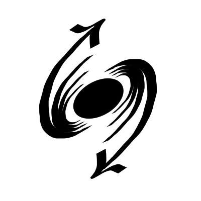

#  DPsim

[](https://git.rwth-aachen.de/acs/public/simulation/dpsim/commits/master)
[](https://git.rwth-aachen.de/acs/public/simulation/dpsim/commits/master)

DPsim is a solver library for power system simulation.

- It supports both the electro-magnetic transient (EMT) and dynamic phasor (DP) domain.
- It provides a Python module which can be embedded in any Python 3 application / scripts.
- It is implemented in highly-efficient C++ code.
- It supports real-time execution with time-steps up to 50 uS.
- It can load models in the IEC61970 Common Information Model (CIM) XML format.
- It can be interfaced to a variety of protocols and interfaces via [VILLASnode](http://www.fein-aachen.org/projects/villas-framework/).

## Installation
If you just want to use DPsim for simulations, take a look at the [installation instructions](https://acs.pages.rwth-aachen.de/public/simulation/dpsim/Install.html).

If you would like to modify / extend DPsim or build it for a specific platform, take a look at the [build instructions](https://acs.pages.rwth-aachen.de/public/simulation/dpsim/Build.html).

## Usage
DPsim is a Python extension module which is implemented in optimized native C++ code. 
Users can control and script the simulation with Python scripts. Checkout the [Examples](https://acs.pages.rwth-aachen.de/public/simulation/dpsim/Examples.html).

## Documentation

The [user documentation](https://acs.pages.rwth-aachen.de/public/simulation/dpsim/about.html) has examples, build / installation instructions and covers the Python API.

The C++ [developer documentation](https://acs.pages.rwth-aachen.de/public/simulation/dpsim/cxx/index.html) only includes automatically generated content using Doxygen.
It is helpful to understand the general structure of the C++ DPsim core components.

## Copyright

2017, Institute for Automation of Complex Power Systems, EONERC, RWTH Aachen University

## License

This project is released under the terms of the [GPL version 3](https://git.rwth-aachen.de/acs/public/simulation/dpsim/blob/master/COPYING.md).

```
This program is free software: you can redistribute it and/or modify
it under the terms of the GNU General Public License as published by
the Free Software Foundation, either version 3 of the License, or
any later version.

This program is distributed in the hope that it will be useful,
but WITHOUT ANY WARRANTY; without even the implied warranty of
MERCHANTABILITY or FITNESS FOR A PARTICULAR PURPOSE.  See the
GNU General Public License for more details.

You should have received a copy of the GNU General Public License
along with this program.  If not, see <http://www.gnu.org/licenses/>.
```

For other licensing options please consult [Prof. Antonello Monti](mailto:amonti@eonerc.rwth-aachen.de).

## Contact

- Markus Mirz <mmirz@eonerc.rwth-aachen.de>
- Steffen Vogel <stvogel@eonerc.rwth-aachen.de>

[Institute for Automation of Complex Power Systems (ACS)](http://www.acs.eonerc.rwth-aachen.de)  
[EON Energy Research Center (EONERC)](http://www.eonerc.rwth-aachen.de)  
[RWTH University Aachen, Germany](http://www.rwth-aachen.de)  

