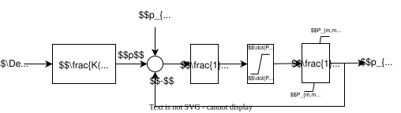
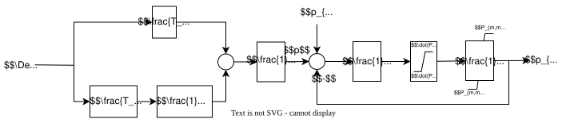
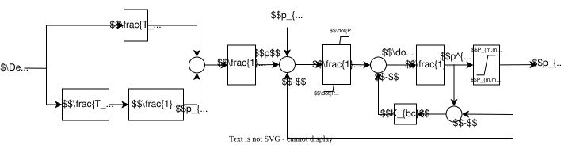
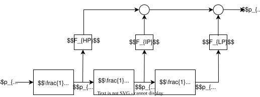
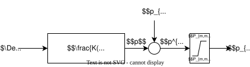
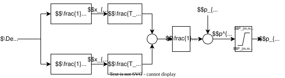
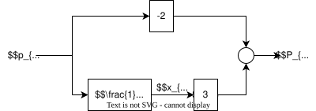

## Steam Governor

<figure margin=30%>
    
    <figcaption> Fig. 8: Control diagram of the steam turbine governor  
                Adapted from [6]
    </figcaption>
</figure>

 

The control diagram of this model is depicted in Fig. 8. This model receives as input the frequency deviation $\Delta\omega = \omega_{ref} - \omega$ from the nominal frequency (normally $50\,\text{Hz}$ or $60\,\text{Hz}$) and produces the valve opening signal $p_{gv}$ for the turbine. $p_{ref}$ is the mechanical power produced at nominal frequency. The governor implements a lead-lag controller $\frac{K(1+sT_2)}{(1+sT_1)}$ where $K=1/R$ and $R$ is the droop coefficient, followed by a PT1 integrator with embedded rate limiters and an anti-windup loop. To avoid unnecessary dead-beat behaviour, complex transfer functions with more than one pole and zero are decomposed via partial fraction expansion into parallel PT1 elements, as shown in Fig. 9.

<figure margin=30%>
    
    <figcaption> Fig. 9: Control diagram of the steam turbine governor after partial-fraction decomposition  
    </figcaption>
</figure>

 

Analogous to the static exciter model, the integrator uses an anti-windup strategy as shown in Fig. 10.

<figure margin=30%>
    
    <figcaption> Fig. 10: Control diagram of the steam turbine governor with anti-windup strategy  
    </figcaption>
</figure>

 

The forward-Euler discretised equations are:
$$
    \Delta \omega (k-\Delta t) = \omega_{ref} - \omega (k-\Delta t),
$$
$$
    p_{1}(k) = p_{1}(k-\Delta t) + \frac{\Delta t}{T_{1}} \left(\Delta \omega (k-\Delta t) \cdot \frac{T_{1} - T_{2}}{T_{1}} - p_{1}(k-\Delta t)\right),
$$
$$
    p(k-\Delta t) = \frac{1}{R} \left(p_{1}(k-\Delta t) + \Delta \omega(k-\Delta t) \cdot \frac{T_{2}}{T_{1}}\right),
$$
$$
    \dot{p}(k-\Delta t) = \frac{1}{T_{3}}\left(p(k-\Delta t) + p_{ref} - p_{gv}(k-\Delta t)\right) - K_{bc} \left(p_{gv}^{*}(k-\Delta t) - p_{gv}(k-\Delta t)\right),
$$
$$
    p_{gv}^{*}(k) = p_{gv}^{*}(k-\Delta t) + \Delta t \cdot \dot{p}(k-\Delta t),
$$

and

$$
p_{gv}(k) = p_{gv}^{*}(k) \quad \text{if} \quad P_{m,\min} \leq p_{gv}^{*}(k) \leq P_{m,\max}, \\
p_{gv}(k) = P_{m,\max} \quad \text{if} \quad p_{gv}^{*}(k) > P_{m,\max}, \\
p_{gv}(k) = P_{m,\min} \quad \text{if} \quad p_{gv}^{*}(k) < P_{m,\min}.
$$

If $T_1 = 0$ the $p_1(k)$ equation is skipped and $p(k)$ is instead:
$$
    p(k-\Delta t) = \frac{1}{R} \left(\Delta \omega(k-\Delta t) + \frac{T_{2}}{\Delta t} \left(\Delta \omega(k-\Delta t) - \Delta \omega(k-2\Delta t)\right)\right).
$$

Assuming the simulation starts in steady state (all derivatives zero, $\Delta\omega(0)=0$), the initial values are:
$$
    p_{1}(t=0) = 0, \quad p(t=0) = 0, \quad p_{ref} = p_{gv}^{*}(t=0) = p_{gv}(t=0).
$$

## Steam Turbine

<figure margin=30%>
    
    <figcaption> Fig. 11: Control diagram of the steam turbine  
                Adapted from [6]
    </figcaption>
</figure>

 

The steam turbine receives the valve opening signal $p_{gv}$ from the Steam Governor and outputs mechanical power $p_m$ to the synchronous generator. It is divided into high-pressure (HP), intermediate-pressure (IP), and low-pressure (LP) stages, each modelled as a first-order lag with time constants $T_{CH}$, $T_{RH}$, $T_{CO}$ respectively. Setting a time constant to zero disables that lag element. The total mechanical power is a weighted sum of each stage: $F_{HP} + F_{IP} + F_{LP} = 1$ must hold. The forward-Euler discretised equations are:

$$
    p_{hp}(k) = p_{hp}(k-\Delta t) + \frac{\Delta t}{T_{CH}} \left(p_{gv}(k-\Delta t) - p_{hp}(k-\Delta t)\right),
$$
$$
    p_{ip}(k) = p_{ip}(k-\Delta t) + \frac{\Delta t}{T_{RH}} \left(p_{hp}(k-\Delta t) - p_{ip}(k-\Delta t)\right),
$$
$$
    p_{lp}(k) = p_{lp}(k-\Delta t) + \frac{\Delta t}{T_{CO}} \left(p_{ip}(k-\Delta t) - p_{lp}(k-\Delta t)\right),
$$
$$
    p_{m}(k) = F_{HP} \cdot p_{hp}(k) + F_{IP} \cdot p_{ip}(k) + F_{LP} \cdot p_{lp}(k).
$$

Assuming the simulation starts in steady state (all derivatives zero), the initial values are:
$$
    p_{hp}(t=0) = p_{gv}(t=0), \quad p_{ip}(t=0) = p_{hp}(t=0), \quad p_{lp}(t=0) = p_{ip}(t=0),
$$
$$
    p_{m}(t=0) = F_{HP} \cdot p_{hp}(t=0) + F_{IP} \cdot p_{ip}(t=0) + F_{LP} \cdot p_{lp}(t=0).
$$

## Hydro Turbine Governor

<figure margin=30%>
    
    <figcaption> Fig. 12: Control diagram of a hydro turbine governor  
                Adapted from [6]
    </figcaption>
</figure>

 

The Hydro Turbine Governor receives the frequency deviation $\Delta\omega = \omega_{ref} - \omega$ as input and produces the valve/gate opening signal $p_{gv}$ for the turbine. $p_{ref}$ is the mechanical power produced at nominal frequency. The controller transfer function is $K\frac{1+sT_2}{(1+sT_1)(1+sT_3)}$, where $K=\frac{1}{R}$ and $R$ is the droop coefficient. The transfer function is decomposed into two parallel PT1 blocks as shown in Fig. 13.

<figure margin=30%>
    
    <figcaption> Fig. 13: Control diagram of a hydro turbine governor after partial-fraction decomposition  
    </figcaption>
</figure>

 

The forward-Euler discretised equations are:
$$
    x_{1}(k) = x_{1}(k-\Delta t) + \frac{\Delta t}{T_{1}} \left(\Delta\omega(k-\Delta t) - x_{1}(k-\Delta t)\right),
$$
$$
    x_{2}(k) = x_{2}(k-\Delta t) + \frac{\Delta t}{T_{3}} \left(\Delta\omega(k-\Delta t) - x_{2}(k-\Delta t)\right),
$$
$$
    p^{*}_{gv}(k) = \frac{1}{R}\left(A \cdot x_{1}(k) + B \cdot x_{2}(k)\right) + p_{ref},
$$

where
$$
A = \frac{T_{1}-T_{2}}{T_{1}-T_{3}}, \qquad B = \frac{T_{2}-T_{3}}{T_{1}-T_{3}},
$$

and the output limiter is applied as:
$$
p_{gv}(k) = \begin{cases}
  P_{m,\max} & \text{if } p^{*}_{gv}(k) > P_{m,\max}, \\
  P_{m,\min} & \text{if } p^{*}_{gv}(k) < P_{m,\min}, \\
  p^{*}_{gv}(k) & \text{otherwise.}
\end{cases}
$$

Assuming the simulation starts in steady state (all derivatives zero, $\Delta\omega(t=0)=0$), the initial values are:
$$
    x_{1}(t=0) = 0, \quad x_{2}(t=0) = 0, \quad p_{ref} = p_{gv}(t=0).
$$

## Hydro Turbine

<figure margin=30%>
    
    <figcaption> Fig. 14: Control diagram of a hydro turbine  
                Adapted from [6]
    </figcaption>
</figure>

 

The Hydro Turbine receives the gate opening signal $p_{gv}$ from the Hydro Turbine Governor and outputs mechanical power $p_m$ to the synchronous generator. The transfer function is specified by the water starting time $T_W$ and can be represented as the sum of two parallel blocks as shown in Fig. 15.

<figure margin=30%>
    
    <figcaption> Fig. 15: Control diagram of a hydro turbine after decomposition  
                Adapted from [6]
    </figcaption>
</figure>

 

The forward-Euler discretised equations are:
$$
    x_{1}(k) = x_{1}(k-\Delta t) + \frac{\Delta t}{0.5\,T_{W}} \left(p_{gv}(k-\Delta t) - x_{1}(k-\Delta t)\right),
$$
$$
    p_{m}(k) = 3\,x_{1}(k) - 2\,p_{gv}(k).
$$

Assuming the simulation starts in steady state (all derivatives zero), the initial values are:
$$
    x_{1}(t=0) = p_{gv}(t=0), \quad p_{m}(t=0) = p_{gv}(t=0).
$$
