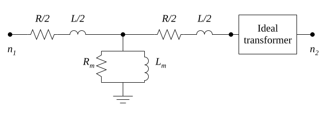

## 2-Winding Transformer

The transformer model is composed of an RL-segment and an ideal transformer.
The single line diagram is depicted in the figure below.



If node reduction is not applied, two virtual nodes are created to stamp this model into the system matrix.

Furthermore, the ideal transformer has an additional equation, which requires an extension of the system matrix.
The complete matrix stamp for the ideal transformer is

```math
\begin{array}{c|c c c}
  ~ & j & k & l \cr
  \hline
  j &  &  & -1 \cr
  k &  &  & T \cr
  l & 1 & -T & 0
\end{array}
\begin{pmatrix}
v_j \cr
v_k \cr
i_{l} \cr
\end{pmatrix}
=
\begin{pmatrix}
  \cr
  \cr
  0\cr
\end{pmatrix}
```

The variable $j$ denotes the high voltage node while $k$ is the low voltage node.
$l$ indicates the inserted row and column to accommodate the relation between the two voltages at the ends of the transformer.
The transformer ratio is defined as $T = V_{j} / V_{k}$.
A phase shift can be introduced if $T$ is considered as a complex number.

## Why the ideal part needs an extra equation

The ideal transformer imposes two constraints at once: the voltages are in a fixed ratio and the
powers on the two sides are equal, which makes the currents inversely proportional to the same ratio,

```math
\frac{v_j}{v_k} = T, \qquad i_k = -T \, i_j .
```

Neither is a current balance at a node, so neither can be written as an admittance. This is the same
situation as an ideal voltage source described under [sources](): the
system is extended with the branch current as an unknown, the constraint occupies the added row, and
the added diagonal entry is zero. The asymmetry of the stamp, $-1$ against $T$ in the added column
and $1$ against $-T$ in the added row, is exactly the statement that voltage scales by $T$ while
current scales by $1/T$ with opposite sign.

Making $T$ complex adds a phase shift, which is how a delta-wye connection is represented without
modelling the windings. The magnitude and the angle then carry the tap ratio and the vector group
respectively.

## Series impedance and the direction of the ratio

The winding resistance and leakage inductance are lumped into one series branch on one side of the
ideal part rather than split between the two sides. Referring an impedance across an ideal
transformer scales it by $T^2$, so the choice of side is a choice of reference, not an
approximation, and the parameters have to be given consistently with it.

The ratio is defined greater than one, from high voltage to low. Supplying it the other way round
describes the same physical device but with the two ends exchanged, so a transformer given an
inverted ratio has to have its terminal assignment inverted with it to remain the same transformer.

## Numerical damping

Connecting an inductive branch between two nodes that have no other path to ground leaves those
nodes weakly defined, and the resulting matrix can be poorly conditioned or singular. Small shunt
elements at each terminal remove that, at the cost of a negligible current that would not exist in
the physical device.

Those elements are sized from the transformer's rated power, which makes the rating a required
parameter rather than documentation. Without a positive rating there is no scale to size them
against, and the natural result is an infinite resistance and a zero capacitance whose admittance is
not a number. A single such entry propagates through the factorisation and destroys the whole
solution, not merely the transformer, so the rating cannot be treated as optional.
