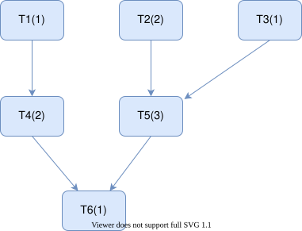

Within each simulation timestep, DPsim executes a set of **tasks**: discrete units of computation contributed by components, the solver, interfaces, and loggers.
Before the first timestep the scheduler collects all tasks, resolves their data dependencies into a directed acyclic graph, and produces an ordered schedule.
That schedule is then replayed on every timestep with no further graph analysis.

---

## Tasks

### The Task base class

Every task is an instance of a class that inherits from `CPS::Task`
(`dpsim-models/include/dpsim-models/Task.h`).
Each subclass implements one member function:

```cpp
virtual void execute(Real time, Int timeStepCount) = 0;
```

To participate in scheduling, a task declares its data dependencies through three attribute lists that are populated in the task's constructor:

| List | Meaning |
|------|---------|
| `mAttributeDependencies` | Attributes this task *reads* in `execute()` |
| `mModifiedAttributes` | Attributes this task *writes* in `execute()` |
| `mPrevStepDependencies` | Attributes whose value from the *previous* timestep this task needs |

All three lists hold `AttributeBase::Ptr` objects, the same pointers used throughout the component model.
See [Attributes]() for details on the attribute system.

{}
Only attributes can participate in scheduling. Plain C++ member variables, a `Real`, a `Matrix` or
an internal state struct, are invisible to the scheduler, so no dependency edge can be formed around
them.

The same constraint governs recording and exchange: `DataLogger` and `RealTimeDataLogger` both
implement `DataLoggerInterface`, whose `logAttribute()` accepts only an `AttributeBase::Ptr`, and the
VILLASnode interface works the same way.

So any value that must cross a task boundary, be written to a result file, or be exchanged with
another tool has to be stored in an `Attribute<T>`. Deciding that late means changing the component
rather than the call site.
{}

The component text logger (`CPS::Logger`, backed by spdlog) is a separate mechanism used for human-readable debug and diagnostic output.
It is not part of the scheduling system and can print any value regardless of whether it is an attribute.

For practical rules on when a variable should be an attribute versus a plain member variable, see [Attribute Usage Guidelines]().

### Common component task conventions

The names below are component and solver conventions, not scheduler-level concepts.
The scheduler only sees the attribute dependencies a task declares; it has no notion of a "PreStep" or "PostStep" and never orders tasks by these names.

MNA components typically define two task classes per component:

| Task | Typical responsibility |
|------|----------------------|
| `MnaPreStep` | Component-specific preparation before the matrix solve, often updating internal state and stamping the right-hand-side contribution |
| `MnaPostStep` | Component-specific update after the matrix solve, often reading the solution vector to update interface voltages and currents |

This is a common pattern rather than a fixed rule; the exact work each task does is component-specific.
Signal-domain components (regulators, governors, control blocks) define their own task list via `getTasks()`; many separate previous-step state handling from output updates, for example a `PreStep` that copies state from the previous step and a `Step` that updates the block outputs.

The solver itself contributes a task that solves the MNA system; individual components do not depend on it by name, they depend on `leftVector` instead (see below).

---

## Building the schedule

### Task collection

`Simulation::prepSchedule()` collects all tasks before the first timestep from three top-level sources:

- **Solvers**: each solver contributes its task list via `Solver::getTasks()`. For MNA solvers this list bundles:
   - the matrix-solve task,
   - MNA component pre-/post-step tasks from `MNASimPowerComp::mnaTasks()` (built during solver initialization via `mnaAddPreStepDependencies()` / `mnaAddPostStepDependencies()`),
   - signal-domain component tasks returned by `SimSignalComp::getTasks()`,
   - optional solver-side tasks, such as state-space extraction, when enabled.
- **Interfaces**: each interface contributes its own tasks via `Interface::getTasks()`. These typically depend on the attributes exchanged with external systems.
- **Loggers**: each logger contributes a logging task via `Logger::getTask()`, depending on the logged attributes so values are written after the producing tasks have run.

All tasks are placed in a flat `Task::List` and handed to the scheduler.

### Dependency resolution

`Scheduler::resolveDeps()` (`dpsim/src/Scheduler.cpp`) translates the attribute-level declarations into directed edges between tasks.
For every attribute in `mModifiedAttributes`, it finds all tasks that list that attribute in their `mAttributeDependencies` and adds an edge:


graph LR
  A["Task A<br/>modifies attr_X"] -->|attr_X| B["Task B<br/>depends on attr_X"]


Task A modifies `attr_X` and task B depends on it, so the edge runs A to B and the scheduler must
place A first.

A special `Root` sentinel task is inserted as a sink for all `mPrevStepDependencies` entries.
Its role is explained in the pruning step below.

### Topological sort and pruning

`Scheduler::topologicalSort()` first runs a backward breadth-first search (BFS) from `Root`, marking every task that transitively contributes to a simulation output.
Tasks not reachable in this pass are **dropped** from the schedule because they produce data no downstream consumer reads in the current timestep.

Kahn's algorithm then processes the remaining tasks in dependency order and appends them to the schedule.
The result is a flat, ordered list in which every task appears after all of its current-step predecessors.

The `Root` sentinel matters here: it holds a reference to an external attribute updated by an interface or by the solver, so the backward BFS reaches it and keeps every task that writes previous-timestep state, even when that output is only consumed in the next timestep.

### Level scheduling

For parallel execution the ordered list is converted into levels by `Scheduler::levelSchedule()`.
Each task is assigned to the level one greater than the highest-level task it depends on:


graph TD
  subgraph L0["level 0: no dependencies, all start at once"]
    T1; T2; T3
  end
  subgraph L1["level 1: depend only on level 0"]
    T4; T5
  end
  subgraph L2["level 2"]
    T6
  end
  T1 --> T4
  T2 --> T4
  T3 --> T5
  T4 --> T6
  T5 --> T6


Tasks within the same level have no data dependencies between them and can execute in parallel.
The scheduler guarantees that all tasks in level *k* finish before any task in level *k+1* starts.



### Scheduler variants

| Class | Parallelism strategy |
|-------|---------------------|
| `SequentialScheduler` | Single-threaded; follows topological order |
| `ThreadLevelScheduler` | Distributes each level across *N* worker threads |
| `ThreadListScheduler` | Distributes tasks greedily across *N* threads |
| `OpenMPLevelScheduler` | Uses `#pragma omp parallel for` per level |

The scheduler is chosen at `Simulation` construction time; `SequentialScheduler` is the default.

### Per-timestep execution

`Scheduler::step(time, timeStepCount)` is called once per timestep.
For the sequential scheduler:

```cpp
for (auto& task : mSchedule)
    task->execute(time, timeStepCount);
```

Parallel schedulers distribute tasks across threads within each level and synchronize with a barrier before advancing to the next level.

---

This page describes how the scheduler works. For how to give a component tasks of its own, see
[adding tasks to a component]().
