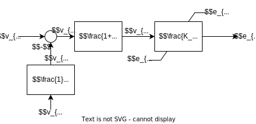
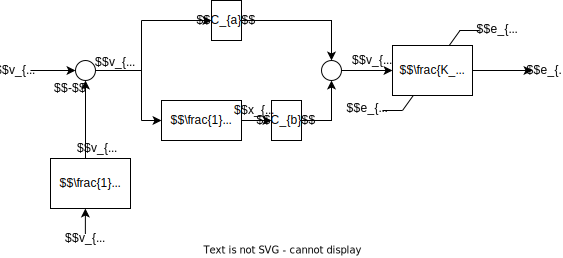
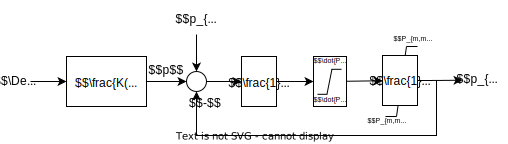
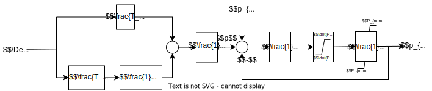
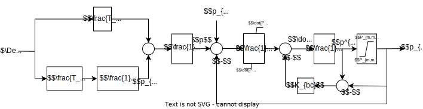
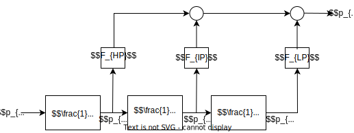
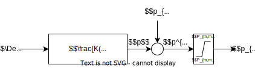
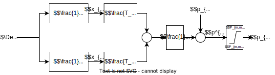
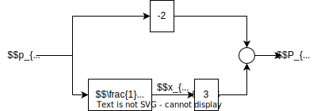

In DPSim, synchronous generator control systems are solved separately from the electric network. The outputs of the electric network (active and reactive power, node voltages, branch currents and rotor speed of synchronous generators) at time $k- \Delta t$ are used as the input of the controllers to calculate their states at time $k$. Because of the relatively slow response of the controllers, the error in the network solution due to the time delay $\Delta t$ introduced by this approach is negligible.  

## Exciter

 DC1 type model is the standard IEEE type DC1 exciter, whereas the other model is a simplified version of the IEEE DC1 type model. The inputs of the exciters are the magnitude of the terminal voltage of the generator connected to the exciter $v_h$ and the voltage reference $v_{ref}$, which is defined as a variable since other devices such as over-excitation limiters or power system stabilizers (PSS) modify such reference with additional signals. At the moment, no over-excitation limiters have been implemented in DPSim so that the reference voltage is given by:
$$
    v_{ref}(t) = v_{ref,0} + v_{pss}(t)
$$
where $v_{ref,0}$ is initialized after the power flow computations and $v_{pss}(t)$ is the output of the (optional) PSS connected to the exciter. The output of the exciter systems is the induced emf by the field current at $t=k + \Delta t$: $v_{ef}(k + \Delta t)$ (sometimes the alternative notation $e_{fd}(k + \Delta t)$ is used). 

### IEEE Type DC1 exciter model

<figure margin=30%>
    
    <figcaption>Fig. 1: Control diagram of the IEEE Type DC1 exciter  
                Adapted from: Milano, Frequency Variations in Power Systems
    </figcaption>
</figure>

This model is used to represent field controlled dc commutator exciters with continuously acting voltage regulators (especially the direct-acting rheostatic, rotating
amplifier, and magnetic amplifier types). The control diagram of this exciter is depicted in Fig. 1 and it is described by the following set of differential equations: 
  

$$
    T_{R} \frac{d}{dt} v_{R}(t) = v_{h}(t) - v_{R}(t)
$$

$$
    T_{b} \frac{d}{dt} v_{b}(t) = v_{ref} - v_{R}(t) - v_{f}(t) - v_{b}(t),
$$
$$
    T_{a} \frac{d}{dt} v_{a}(t) = K_{a} v_{in}(t) - v_{a}(t),
$$
$$
    T_{f} \frac{d}{dt} v_{f}(t) - K_{f} \frac{d}{dt} v_{ef}(t) = -v_{f}(t),
$$
$$
    T_{ef} \frac{d}{dt} v_{ef}(t) = v_{a}(t) - (K_{ef} + sat(t)) v_{ef}(t),
$$
where $v_h$ is the module of the machine's terminal voltage, and $v_{in}$ is the amplifier input signal, which for the IEEE Type DC1 is given by:
$$
    v_{in}(t) = T_{c} \frac{d}{dt} v_b(t) + v_b(t).
$$

The ceiling function approximates the saturaiton of the excitation winding:
$$
    sat(t) = A_{ef} e^{(B_{ef} | v_{ef}(t) | )}
$$

The set of differential equations are discretized using forward euler in order to solve it numerically, which leads to the following set of algebraic equations:
$$
    v_R(k + \Delta t) = v_R(k) + \frac{\Delta t}{T_R}  ( v_h(k) - v_R(k) ),
$$
$$
    v_b(k + \Delta t) = v_b(k)(1 - \frac{\Delta t}{T_b}) + \frac{\Delta t}{T_b}  ( v_{ref}(k) - v_R(k) - v_f(k)),
$$
$$
    v_{in}(k + \Delta t) = \Delta t \cdot \frac{T_c}{T_b} (v_{ref}(k) - v_R(k) - v_{f}(k) - v_b(k)) + v_b(k+1),
$$
$$
    v_a(k + \Delta t) = v_a(k) + \frac{\Delta t}{T_a} ( v_{in}(k) K_a - v_a(k) ),
$$
$$
    v_f(k + \Delta t) = (1 - \frac{\Delta t}{T_f}) v_f(k) + \frac{\Delta t K_f}{T_f T_{ef}} ( v_{a}(k) - (K_{ef} + sat(k)) v_{ef}(k) ),
$$
$$
    v_{ef}(k + \Delta t) = v_{ef}(k) + \frac{\Delta t}{T_{ef}} ( v_{a}(k) - (sat(k) + K_{ef}) v_{ef}(k)),
$$
$$
    sat(k) = A_{ef} e^{(B_{ef} | v_{ef}(k) | )}
$$

Since the values of all variables for $t=k$ are known, $v_{ef}(k+1)$ can be easily calculated using the discretised equations, which is carried out in the `preStep` function of the generator connected to each exciter. 

The initial values of all variables, which are used in the first simulation step, are calculated assuming that the simulation starts in the steady. This is equivalent to assume that all derivative are equal to zero, which leads to:
$$
    v_R(k=0) = v_h(k=0),
$$
$$
    v_f(k=0) = 0
$$
$$
    v_a(k=0) = K_{ef} v_{ef}(k=0) + A_{ef} e^{B_{ef} |v_{ef} (k=0)|} v_{ef}(k=0), 
$$
$$
    v_{in}(k=0) = \frac{v_a(k=0)}{K_a},
$$
$$
    v_b(k=0) = v_{in}(k=0),
$$
$$
    v_{ref}(t=0) = v_{in}(t=0) + v_b(t=0),
$$
where $v_h(k=0)$, $v_{ef}(k=0)$ are calculated after the power flow analysis and after the initialization of synchronous machines (see section initialization of SG). 

### Simplified IEEE Type DC1 exciter model (DC1Simp)

<figure>
    
    <figcaption> Fig. 2: Control diagram of the IEEE Type DC1 exciter  
            Adapted from: Milano, Power System Modelling and Scripting
    </figcaption>
</figure>

 

Because the time constants $T_b$ and $T_c$ of the IEEE Type DC1 exciter model are frequenty small enough to be neglected, in DPSim a simplified model of this exciter which neglect these time constants is also implemented. The control diagram of this exciter is depicted in Fig. 2 and it is described by the following set of differential equations:
$$
    T_R \frac{d}{dt} v_R(t) = v_h(t) - v_R(t)
$$
$$
    T_a \frac{d}{dt} v_a(t) = - v_a(t) + K_a v_{in}(t)
$$
$$
    T_f \frac{d}{dt} v_f(t) - K_f \frac{d}{dt} v_{ef}(t) = -v_f(t),
$$
$$
    T_e \frac{d}{dt} v_{ef}(t) = v_a(t) - v_{ef}(t) (sat(t) + K_{ef})
$$
where $v_h$​ is the module of the machine's terminal voltage, and $v_{in}$​ is the amplifier input signal, which is given by: 
$$
    v_{in}(t) = v_{ref} (t) - v_R(t) - v_f(t)
$$
The set of differential equations are discretized using forward euler in order to solve it numerically, which leads to the following set of algebraic equations: 
$$
    v_R(k + \Delta t) = v_R(k) + \frac{\Delta t}{T_R}  ( v_h(k) - v_R(k) ),
$$
$$
    v_{in}(k) = v_{ref}(k) - v_R(k) - v_f(k),
$$
$$
    v_a(k + \Delta t) = v_a(k) + \frac{\Delta t}{T_a} ( v_{in}(k) K_a - v_a(k) ),
$$
$$
    v_f(k + \Delta t) = (1 - \frac{\Delta t}{T_f}) v_f(k) + \frac{\Delta t K_f}{T_f T_{ef}} ( v_{a}(k) - (K_{ef} + sat(k)) v_{ef}(k) ),
$$
$$
    v_{ef}(k + \Delta t) = v_{ef}(k) + \frac{\Delta t}{T_{ef}} ( v_{a}(k) - (sat(k) + K_{ef}) v_{ef}(k)),
$$
$$
    sat(k) = A_{ef} e^{(B_{ef} | v_{ef}(k) | )}
$$

Since the values of all variables for $t=k$ are known, $v_{ef}(k+1)$ can be easily calculated using the discretised equations, which is carried out in the `preStep` function of the generator connected to each exciter. 

The initial values of all variables, which are used in the first simulation step, are calculated assuming that the simulation starts in the steady. This is equivalent to assume that all derivative are equal to zero, which leads to:
$$
    v_R(k=0) = v_h(k=0),
$$
$$
    v_f(k=0) = 0,
$$
$$
    v_a(k=0) = K_{ef} v_{ef}(k=0) + A_{ef} e^{B_{ef} |v_{ef} (k=0)|} v_{ef}(k=0), 
$$
$$
    v_{in}(k=0) = \frac{v_a(k=0)}{K_a},
$$
$$
    v_{ref}(t=0) = v_R(t=0) + v_{in}(t=0),
$$
where $v_h(k=0)$, $v_{ef}(k=0)$ are calculated using the power flow analysis and after the initialization of synchronous machines (see section initialization of SG).

### Static Exciter

<figure margin=30%>
    
    <figcaption>Fig. 3: Control diagram of the Static Exciter  
                Adapted from [7]
    </figcaption>
</figure>

The control diagram of this is depicted in Fig. 3. It can be observed as a simplified version of the DC1 type exciter which is componsed only by the regulator, the amplifier and an optional transducer. To discretize the lead-lag compensator using using forward euler it is better to split this block into two parallel blocks as depicted in Fig. 4.

<figure margin=20%>
    
    <figcaption>Fig. 4: Control diagram of the Static Exciter  
    </figcaption>
</figure>

where:

$$
    C_{a} = \frac{T_{a}}{T_{b}}, \quad C_{b} = \frac{T_{b}-T_{a}}{T_{b}}.
$$
and it is described by the following set of differential equations:
$$
    T_{R} \frac{d}{dt} v_{r}(t) = v_{h}(t) - v_{r}(t)
$$
$$
    T_{b} \frac{d}{dt} x_{b}(t) = v_{in}(t) - x_{b}(t)
$$
$$
    T_{e} \frac{d}{dt} e_{fd}(t) = K_{a} v_{e}(t) - e_{fd}(t),
$$

Then, the set of differential equations are discretized using forward euler in order to solve it numerically, which leads to the following set of algebraic equations: 

$$
    v_r(k + \Delta t) = v_r(k) + \frac{\Delta t}{T_R}  ( v_h(k) - v_r(k) ),
$$
$$
    v_{in}(k) = v_{ref}(k) - v_{r}(k),
$$
$$
    X_b(k + \Delta t) = \frac{\Delta t}{T_{b}} (v_{in}(k) - x_{b}(k)) + x_{b}(k),
$$
$$
    v_e(k) = K_{a} (C_{b} x_{b}(k) + C_{a} v_{in} (k)) ,
$$
$$
    e_{fd}(k + \Delta t) = \frac{\Delta t}{T_{e}}(v_{e}(k) - e_{fd}(k)) + e_{fd}(k).
$$

To consider the saturation of $e_{fd}$ there are two different implementations, which is automatically selected depending of value of the parameter $K_{bc}$:

1. *standard ($K_{bc}=0$)*:

$$
e^{*}_{fd} = e_{fd, max} \quad \quad if \quad \quad e^{*}_{fd} > e_{fd, max} \\
e^{*}_{fd} = e_{fd, min} \quad \quad if \quad \quad e^{*}_{fd} > e_{fd, min},
$$

where $e^{*}_{fd}$ represents the output of the exciter.

2. *anti_windup* ($K_{bc}>0$): for controllers with an integral component, i.e. also for PID controllers, the so-called "windup effect" can occur when using the *standard* saturation function. A strategy for limiting the anti-windup effect is shown in Fig. 5.

<figure margin=20%>
    
    <figcaption>Fig. 5: Control diagram of the Static Exciter with anti windup strategy  
    </figcaption>
</figure>

which means that the input of the differential equation describing $e_{fd}$, $v_{e}$, takes now the following form:

$$
v_{e} = C_{a} v_{in} + C_{b} x_{b} - K_{bc} (e_{fd} - e_{fd}^{*}) 
$$

The initial values of all variables, which are used in the first simulation step, are calculated assuming that the simulation starts in the steady. This is equivalent to assume that all derivative are equal to zero, which leads to:

$$
v_{r}(t=0) = v_{h}(t=0),
$$

$$
v_{e}(t=0) = \frac{e_{fd}(t=0)}{K_{a}},
$$

$$
v_{in}(t=0) = \frac{v_{e}(t=0)}{C_{a}+C_{b}},
$$

$$
x_{b}(t=0) = v_{in}(t=0),
$$

$$
v_{ref}(t=0) = v_{in}(t=0) - v_{r}(t=0)
$$

## Power Systen Stabilizer (PSS)
PSS is a controller of synchonous generators used to enhance damping electromechanical oscillations. The input of the PSS implemented in DPSim is the rotor speed of the machine. The PSS output $v_{pss}$ at time $t=k$ is a signal used as the input of the AVR to calculate the field voltage at $t=k+\Delta t$, $v_{fd}(k+\Delta t)$. At present, only one PSS is implemented in DiPSim which is a simplified version of the IEEE PSS1A type model.

### IEEE PSS1A type PSS

<figure margin=30%>
    
    <figcaption>Fig. 6: Control diagram of the PSS Type 1  
                Adapted from: Milano, Power System Modelling and Scripting
    </figcaption>
</figure>

The control diagram of this PSS is depicted in Fig. 6. It includes a washout filter and two lead-lag blocks and is described by the following set of differential equations:
$$
    T_w \frac{d}{dt} v_1(t) = -(K_w \omega (t) + v_1(t)),
$$
$$
    T_2 \frac{d}{dt} v_2(t) = ((1 - \frac{T_1}{T_2})(K_w \omega (t) + v_1(t)) - v_2(t)),
$$
$$
    T_4 \frac{d}{dt} v_3(t) = ((1 - \frac{T_3}{T_4})(v_2(t) + (\frac{T_1}{T_2}(K_w \omega (t) + v_1(t)))) - v_3(t)),
$$
$$
    v_{pss}(t) = v_3(t) + \frac{T_3}{T_4}(v_2(t) + \frac{T_1}{T_2}(K_w \omega (t) + v_1(t))),
$$

where $\omega (t)$ is the input signal of the PSS (rotor speed) and $v_{pss}(t)$ is the output signal of the PSS which is used as an optional signal of the AVR connected to the machine and it is used to modify the reference voltage of the AVR.

The set of differential equations are discretized using forward euler in order to solve it numerically, which leads to the following set of algebraic equations: 
$$
    v_1(k + \Delta t) = v_1(k) - \frac{\Delta t}{T_w} (K_w \omega (k) + v_1(k)),
$$
$$
    v_2(k + \Delta t) = v_2(k) + \frac{\Delta t}{T_2} ((1-\frac{T_1}{T_2})(K_w \omega (k) + v_1(k)) - v_2(k)),
$$
$$
    v_3(k + \Delta t) = v_3(k) + \frac{\Delta t}{T_4} ((1-\frac{T_3}{T_4})(v_2(k) + \frac{T_1}{T_2}(K_w \omega (k) + v_1(k))) - v_{pss}(k)),
$$
$$
    v_{pss}(k) = v_3(k) + \frac{T_3}{T_4} (v_2(k) + \frac{T_1}{T_2} (K_w \omega (k) + v_1(k)))
$$

Since the values of all variables for $t=k$ are known, $v_{pss}(k)$ can be easily calculated using the discretised equations, which is carried out in the `preStep` function of the generator connected to each exciter. Then, $v_{pss}(k)$ is used as input of the AVR to calculate the field voltage at time $k+1$. The values $v_1(k+1)$, $v_2(k+1)$, $v_3(k+1)$ are stored and used to calculate the PSS output of the next time step.  

The initial values of all variables, which are used in the first simulation step, are calculated assuming that the simulation starts in the steady. This is equivalent to assume that all derivative are equal to zero, which leads to:
$$
    v_1(k=0) = -K_w \omega (k=0),
$$
$$
    v_2(k=0) = 0,
$$
$$
    v_3(k=0) = 0,
$$
$$
    v_{PSS}(k=0) = 0,
$$

where $\omega(k=0)$ is calculated after the power flow analysis and after the initialization of synchronous machines (see section initialization of SG) and normally is equal to $1.0$ (pu).

## Turbine Governor Models
In DPsim there are two types of Turbine Governor implementations.  The *Turbine Governor Type 1* implements both, the turbine and the governor, in one component. In difference to that, Steam Turbine and Steam Turbine Governor are implemented as two separate classes, therefore the objects are created separately. Steam/Hydro Turbine and Steam/Hydro Turbine Governor are two blocks that has to be connected in series. 

The input of the turbine governos models is the mechanical omega at time $t=k-\Delta t$ and the output is the mechanical power at time $t=k$. This variable is the used by the SG to predict the mechanical omega at time $t=k+\Delta t$.

### Turbine Governor Type 1

<figure margin=30%>
    
    <figcaption> Fig. 7: Control diagram of the turbine governor type 1  
                Source: Milano, Power System Modelling and Scripting
    </figcaption>
</figure>

 

This model includes a governor, a servo and a reheat block. The control diagram of this governor is depicted in Fig. 7 and it is described by the following set of differential-algebraic equations:
$$
    p_{in}(t) = p_{ref} + \frac{1}{R} (\omega_{ref} - \omega(t)),
$$
$$
    T_s \frac{d}{dt} x_{g1}(t) = (p_{in}(t) - x_{g1}(t)),
$$
$$
    T_c \frac{d}{dt} x_{g2}(t) = ((1- \frac{T_3}{T_c})x_{g1}(t) - x_{g2}(t)),
$$
$$
    T_5 \frac{d}{dt} x_{g3}(t) = ((1-\frac{T_4}{T_5})(x_{g2} + \frac{T_3}{T_c} x_{g1}(t)) - x_{g3}(t))
$$
$$
    \tau_m (t) = x_{g3} (t) + \frac{T_4}{T_5} (x_{g2}(t) + \frac{T_3}{T_c} x_{g1}(t))
$$
where $\omega (t)$ is the input signal and $\tau_{m}(t)$ is the output signal of the governor.

The set of differential equations are discretized using forward euler in order to solve it numerically, which leads to the following set of algebraic equations:
$$
    p_{in}(k-\Delta t) = p_{ref} + \frac{1}{R} (\omega_{ref} - \omega(k-\Delta t)),
$$
$$
    x_{g1}(k) = x_{g1}(k-\Delta t) + \frac{\Delta t}{T_s} (p_{in}(k-\Delta t) - x_{g1}(k-\Delta t)),
$$
$$
    x_{g2}(k) = x_{g2}(k-\Delta t) + \frac{\Delta t}{T_c} ((1 - \frac{T_3}{T_c}) x_{g1}(k-\Delta t) - x_{g2}(k-\Delta t)),
$$
$$
    x_{g3}(k) = x_{g3}(k-\Delta t) + \frac{\Delta t}{T_5} ((1 - \frac{T_4}{T_5}) (x_{g2}(k-\Delta t) + \frac{T_3}{T_c} x_{g1}(k-\Delta t)) - x_{g3}(k-\Delta t)),
$$
$$
    \tau_m(k) = x_{g3}(k) + \frac{T_4}{T_3} (x_{g2}(k) + \frac{T_3}{T_c} x_{g1}(k)),
$$
Since the values of all variables for $t=k-\Delta t$ are known, $\tau_m(k)$ can be easily calculated using the discretised equations, which is carried out in the `preStep` function of the generator connected to each governor. Then, $\tau_m(k)$ is used to approximate the mechanical differential equations of the generator at time $k+\Delta t$.

### Steam Governor

<figure margin=30%>
    
    <figcaption> Fig. 8: Control diagram of the steam turbine governor  
                Adapted from [7]
    </figcaption>
</figure>

 

The control diagram of this model is depicted in Fig. 8. This model gets as input the frequency (rotational speed of the generator)  deviation $\Delta\omega$ from the norminal frequency (normally $50 Hz$ or $60 Hz$) and gives the target value $p_{gv}$ to the turbine. $p_{ref}$ is the mechanical power that is produced at nominal frequency. The governor is implemented as a controller $\frac{K(1+sT_2)}{(1+sT_1)}$, where $K=1/R$ and $R$ it the droop coefficient, and a PT1 lag element with embedded limiters before and after the integrator. To avoid unnecessary dead beat behavior, complex transfer functions, with more then one pole and zero, are represented as a sum of multiple PT1 elements connected in parallel, via partial fracture decomposition, which leads to the control diagram depicted in Fig. 9.

<figure margin=30%>
    
    <figcaption> Fig. 9: Control diagram of the steam turbine governor  
    </figcaption>
</figure>

 

Analog to the static exciter model, this model is implemented using a anti windup strategy as shown in Fig. 10.

<figure margin=30%>
    
    <figcaption> Fig. 10: Control diagram of the steam turbine governor with anti windup strategy  
    </figcaption>
</figure>

 

Finally, the discretized equations using forward euler of this model are given by:
$$
    \Delta \omega (k- \Delta t) = \omega_{ref} - \omega (k- \Delta t),
$$
$$
    p_{1}(k) = p_{1}(k- \Delta t) + \frac{\Delta t}{T_{1}} (\Delta \omega (k- \Delta t) \cdot \frac{T_{1} - T_{2}}{T_{1}} - p_{1}(k- \Delta t)),
$$
$$
    p(k - \Delta t) = \frac{1}{R} (p_{1}(k - \Delta t) + \Delta \omega(k- \Delta t) \cdot \frac{T_{2}}{T_{1}}),
$$
$$
    \dot{p}(k-\Delta t) = \frac{1}{T_{3}}(p(k- \Delta t) + p_{ref} - p_{gv}(k- \Delta t)) - K_{bc} (P_{gv}^{*}(k- \Delta t) - P_{gv}(k- \Delta t)),
$$
$$
    p_{gv}^{*}(k) = p_{gv}^{*}(k- \Delta t) + \Delta t \cdot \dot{p}(k- \Delta t),
$$

and

$$
p_{gv}(k) = p_{gv}^{*}(k) \quad \quad if \quad \quad P_{m, min} <= p_{gv}^{*}(k) <= P_{m, min}, \\
p_{gv}(k) = P_{m, max} \quad \quad if \quad \quad p_{gv}^{*}(k) > P_{m, max}, \\
p_{gv}(k) = P_{m, min} \quad \quad if \quad \quad p_{gv}^{*}(k) > P_{m, min}.
$$

If $T1==0$ the equation for $p_{1}(k)$ is skipped and the equation for $p(k)$ is calculated as follows:
$$
    p(k - \Delta t) = \frac{1}{R} (\Delta \omega(k - \Delta t) + \frac{T_{2}}{\Delta t} (\Delta \omega(k - \Delta t) - \Delta \omega(k - 2\Delta t) )).
$$

The initial values of all variables, which are used in the first simulation step, are calculated assuming that the simulation starts in the steady. This is equivalent to assume that all derivative are equal to zero and that $\Delta \omega(t=0)=0$, which leads to:

$$
    p_{1}(t=0) = 0,
$$
$$
    p(t=0) = 0,
$$
$$
    p_{ref} = p_{gv}(t=0),
$$
$$
    p_{gv}^{*}(t=0) = p_{gv}(t=0),
$$

### Steam Turbine

<figure margin=30%>
    
    <figcaption> Fig. 9: Control diagram of the steam turbine  
                Adapted from [7]
    </figcaption>
</figure>

 

The control diagram of this model is depicted in Fig. 9. It receives as input signal from the Steam Governor $p_{gv}$ and as output gives the mechanical power $p_{m}$ to a synchronous generator. Steam Turbine is divided in high-pressure, intermediate-pressure and low-pressure stages. Each of them is modeled as a first order lag element with time constants $T_{CH}, T_{RH}, T_{CO}$. If a time constant is chosen to be equal to zero, the according lag element is deactivated. The total turbine mechanical power is a sum of powers provided by each stage, each fraction can be modeled with corresponding gain-factors $F_{HP}, F_{IP}, F_{LP}$. Note that the sum of gain-factors should be equal to one $F_{HP}+F_{IP}+F_{LP} = 1$. The discretized equations of this model using forward euler are given by the following equations:

$$
    p_{hp}(k) = p_{hp}(k - \Delta t) + \frac{\Delta t}{T_{CH}} (p_{gv}(k - \Delta t) - p_{hp}(k - \Delta t)),
$$
$$
    p_{ip}(k) = p_{ip}(k - \Delta t) + \frac{\Delta t}{T_{RH}} (p_{hp}(k - \Delta t) - p_{ip}(k - \Delta t)),
$$
$$
    p_{lp}(k) = p_{lp}(k - \Delta t) + \frac{\Delta t}{T_{CO}} (p_{ip}(k - \Delta t) - p_{lp}(k - \Delta t)),
$$
$$
    p_{m}(k) = F_{FP} \cdot p_{hp}(k) + F_{ip} \cdot p_{ip}(k) + F_{LP} \cdot p_{lp}(k)
$$

The initial values of all variables, which are used in the first simulation step, are calculated assuming that the simulation starts in the steady. This is equivalent to assume that all derivative are equal to zero, which leads to:
$$
    p_{hp}(t=0) = p_{gv}(t=0),
$$
$$
    p_{ip}(t=0) = p_{hp}(t=0),
$$
$$
    p_{lp}(t=0) = p_{iv}(t=0),
$$
$$
    p_{m}(t=0) = F_{FP} \cdot p_{hp}(t=0) + F_{ip} \cdot p_{ip}(t=0) + F_{LP} \cdot p_{lp}(t=0)
$$

### Hydro Turbine Governor

<figure margin=30%>
    
    <figcaption> Fig. 11: Control diagram of a hydro turbine governor  
                Adapted from [7]
    </figcaption>
</figure>

 

Hydro Turbine Governor get as input the frequency (rotational speed of the generator) deviation $\Delta\omega$ from the nominal frequency (normally $50 Hz$ or $60 Hz$) and gives the target value $p_{gv}$ to the turbine , $p_{ref}$ is mechanical power that is produced at nominal frequency. The controller transfer function is defined as $K\frac{1+sT_2}{(1+sT_1)(1+sT_3)}$, where $K=\frac{1}{R}$ and $R$ is the droop coefficient. The transfer function can be split into two PT1 blocks as shown in Fig. 12.

<figure margin=30%>
    
    <figcaption> Fig. 12: Control diagram of a hydro turbine governor  
    </figcaption>
</figure>

 

The discretized equations of this model using forward euler are given by the following equations:
$$
    x_{1}(k) = x_{1}(k - \Delta t) + \frac{\Delta t}{T_{1}} (\Delta \omega(k - \Delta t) - x_{1}(k - \Delta t)),
$$
$$
    x_{2}(k) = x_{2}(k - \Delta t) + \frac{\Delta t}{T_{3}} (\Delta \omega(k - \Delta t) - x_{2}(k - \Delta t)),
$$
$$
    p^{*}_{gv}(k) = \frac{1}{R}(A \cdot x_{1}(k) + B \cdot x_{2}(k)) + p_{ref},
$$

where
$$
A = \frac{T_{1}-T_{2}}{T_{1}-T_{3}}, \quad \quad B = \frac{T_{2}-T_{3}}{T_{1}-T_{3}},
$$

and

$$
p_{gv}(k) = p_{gv}^{*}(k) \quad \quad if \quad \quad P_{m, min} <= p_{gv}^{*}(k) <= P_{m, min}, \\
p_{gv}(k) = P_{m, max} \quad \quad if \quad \quad p_{gv}^{*}(k) > P_{m, max}, \\
p_{gv}(k) = P_{m, min} \quad \quad if \quad \quad p_{gv}^{*}(k) > P_{m, min}.
$$

The initial values of all variables, which are used in the first simulation step, are calculated assuming that the simulation starts in the steady. This is equivalent to assume that all derivative are equal to zero and that $\Delta \omega(t=0)=0$, which leads to:

$$
    x_{1}(t=0) = 0,
$$
$$
    x_{2}(t=0) = 0,
$$
$$
    p_{ref} = p_{gv}(t=0),
$$
$$
    p_{gv}^{*}(t=0) = p_{gv}(t=0),
$$

### Hydro Turbine

<figure margin=30%>
    
    <figcaption> Fig. 12: Diagram of a hydro turbine  
                Adapted from [7]
    </figcaption>
</figure>

 

The control diagram of this model is depicted in Fig. 12. It receives as input signal from Hydro Turbine Governor $p_{gv}$ and as output gives the mechanical power $p_{m}$ to a synchronous generator. The transfer function is specified by water starting time parameter $T_{w}$ and can be represented as the sum of two parallel blocks as shown in Fig. 13.

<figure margin=30%>
    
    <figcaption> Fig. 13: Diagram of a hydro turbine  
                Adapted from [7]
    </figcaption>
</figure>

 

The equations modelling this governor are discretized using forward euler and are given by the following equations:
$$
    x_{1}(k) = x_{1}(k - \Delta t) + \frac{\Delta t}{0.5 \cdot T_{W}} (p_{gv}(k - \Delta t) - x_{1}(k - \Delta t)),
$$
$$
    p_{m}(k) = 3 x_{1}(k) - 2 p_{gv}(k),
$$

The initial values of the variables, which are used in the first simulation step, are calculated assuming that the simulation starts in the steady. This is equivalent to assume that all derivative are equal to zero, which leads to:
$$
    x_{1}(t=0) = p_{gv}(t=0),
$$
$$
    p_{m}(t=0) = p_{gv}(t=0).
$$

## References
 - [1] "IEEE Recommended Practice for Excitation System Models for Power System Stability Studies," in IEEE Std 421.5-2016 (Revision of IEEE Std 421.5-2005) , vol., no., pp.1-207, 26 Aug. 2016, doi: 10.1109/IEEESTD.2016.7553421.
 - [2] F. Milano, “Power system modelling and scripting,” in Power System Modelling and Scripting. London: Springer-Verlag, 2010, ISBN: 978-3-642-13669-6. doi: 10.1007/978-3-642-13669-6.
 - [3] F. Milano, A. Manjavacas, “Frequency Variations in Power Systems: Modeling, State Estimation, and Control”. ISBN: 978-1-119-55184-3.
 - [4] F. Milano, "Power System Analysis Toolbox: Documentation for PSAT", ISBN: 979-8573500560.
 - [5] A. Roehder, B. Fuchs, J. Massman, M. Quester, A. Schnettler, "Transmission system stability assessment within an integrated grid development process".
 - [6] M. Eremia; M. Shahidehpour, "Handbook of Electrical Power System Dynamics: Modeling, Stability, and Control", https://ieeexplore.ieee.org/book/6480471
 - [7] A. Roehder, B. Fuchs, J. Massman, M. Quester, A. Schnettler, "Transmission system stability assessment within an integrated grid development process"
