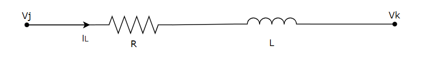
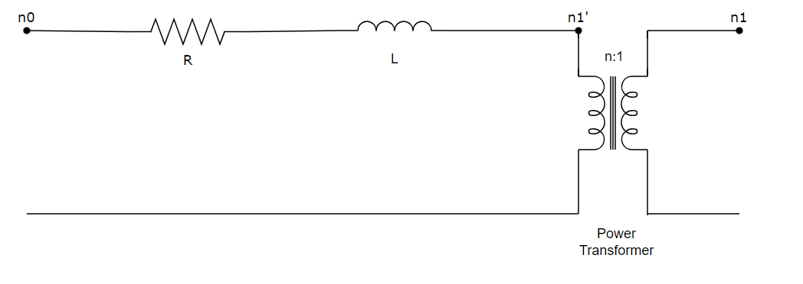

## 2-Winding Power Transformer
The transformer model is composed of an RL-segment and an ideal transformer.
The single line diagram is depicted in the figure below.



An RL- segment in the time domain is described by

$$
\frac{\mathrm{d} i_L(t)}{\mathrm{d}t} = \frac{v_j(t) - v_k(t) - R \cdot i_L(t)}{L}
$$

Transforming it to DP domain, the RL segment is described by 

$$
  \frac{\mathrm{d} \langle i_L \rangle}{\mathrm{d}t} + j\omega \cdot \langle i_L \rangle= \frac{\langle v_j \rangle - \langle v_k \rangle - R \cdot \langle i_L \rangle}{L}
$$

Applying the trapezoidal method leads to the finite difference equation:
```math
\langle i_L \rangle = \frac{(1-b^2 - (a*R)^2 -j*2b) }{(1+a*R)^2+b^2} \cdot \langle i_L \rangle(t - \Delta t) + \frac{a+a^2*R - j *ab}{(1+aR)^2 + b^2} \cdot ( \langle v \rangle + \langle v \rangle(t + \Delta t))
```
with
```math
a = \frac{\Delta t}{2L}, \qquad b = \frac{\Delta t \omega}{2} , \qquad v(t) = v_j(t) - v_k(t)
```

Applying this to the transformer model 

 

```math
i_{n0}(t) = \frac{(1-b^{2} - (aR)^{2} -j2b) }{(1+aR)^{2}+b^{2}} * i_{n0}(t - \Delta t) + \frac{a+a^{2}R - jab}{(1+aR)^{2} + b^{2}} \cdot (\langle v \rangle + \langle v \rangle(t + \Delta t))
```
with
```math
v(t) = v_{n0}(t) - v^{'}_{n1}(t), \qquad v{'}_{n1}(t)= n * v_{n1}(t) , \qquad i_{n1}(t) = n * i_{n0}(t)
```

Substituting for v(t), we get 
```math
i_{n0}(t) = \frac{a+a^{2}R - jab}{(1+aR)^{2} + b^{2}} \cdot (v_{n0}(t) - n v_{n1}(t)) + \frac{(1-b^{2} - (aR)^{2} -j2b) }{(1+aR)^{2}+b^{2}} \cdot i_{n0}(t - \Delta t) + \frac{a+a^{2} R - j *ab}{(1+aR)^{2} + b^{2}} \cdot (v_{n0}(t-\Delta t) - n v_{n1}(t-\Delta t))
```

This is equivalent to 
```math
i_{n0}(t) = Y_{eq} (v_{n0}(t) - nv_{n1}(t)) + I_{eq} 
```
```math
i_{n1}(t) = - n i_{n0}(t)
```

So the admittance matrix becomes 

```math
\begin{pmatrix}
i_{n0} \cr
i_{n1} \cr
\end{pmatrix}
=
\begin{pmatrix}
  Y_{eq} & -nY_{eq}\cr
  -nY_{eq} & n^{2} Y_{eq} \cr
\end{pmatrix} 
* 
\begin{pmatrix}
v_{n0} \cr
v_{n1} \cr
\end{pmatrix} + 
\begin{pmatrix}
I_{eq} \cr
-I_{eq} \cr
\end{pmatrix}
```
