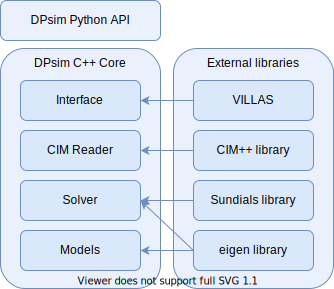
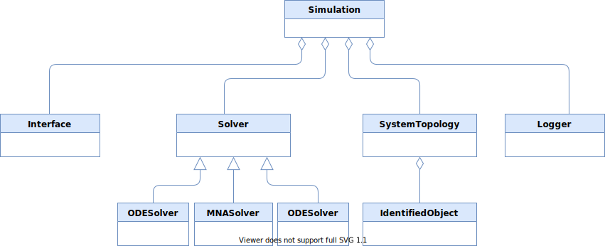
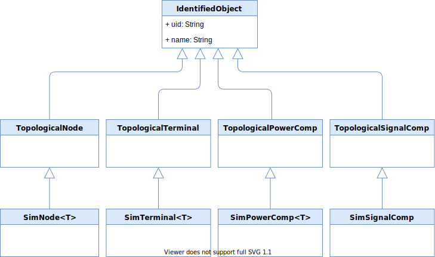

# Modules and Dependencies

The figure below shows the main components of the DPsim library and their dependencies on other software projects.
All functionality is implemented in the C++ core, which can be used standalone or together with the Python interface.
The Python interface is a thin wrapper of the C++ core.
Jupyter notebooks can either use the DPsim Python interface to run simulations or call executables implemented in C++.
The data analysis and plotting is always done in Python using common libraries like Matplotlib.
To collect the simulation results from within Python, one can use the villas-dataprocessing Python package.

Another approach to get data in or out of DPsim is the VILLASnode interface, which does not depend on Python at all.
The main purpose of the VILLASnode interface is to exchange data during the simulation runtime, for example, in real-time simulation experiments.
The data could be send to other simulators, hardware or other software components like databases.
Storing the data in databases can be another way of managing (also offline) simulation results if the Python CSV method is not desireable.

The CIM reader is based on the CIM++ library and provides a comfortable alternative to defining the grid manually in C++ or Python.
In principle, it calls the same functions to create elements, which are also used in the C++ defined example scenarios, but automatically.
DPsim also provides a way to visualize the defined networks before simulation.

The main solver of DPsim is currently the MNA solver because it enables a rather deterministic computation time per simulation time step, which is necessary for real-time simulation.
Apart from that, it is also well established in offline circuit simulation.
The only dependency of the MNA solver is the linear algebra library Eigen.
For some component models, it is possible to use the Sundials ODE solver in combination with the MNA solver. In that case, the component is solved by the ODE solver whereas the network is still handled by the MNA solver.
A DAE solver is currently under development.
Its main purpose will be offline simulation, for example, to provide reference results where simulation runtime and real-time execution are not relevant.

The component models depend mostly on the Eigen library.
Even if components are used in combination with Sundials ODE / DAE solvers, we try to keep the specific functions required by these solvers independent of the Sundials package.

# Class Hierarchy

The `Simulation` class holds references to instances of `Interface`, `Solver`, `Logger` and `SystemTopology`.
For a simulation scenario, the minimum description would include a `SystemTopology` and a solver type.
The `Solver` instance is then created by the `Simulation`.

An important function of the `Simulation` is to collect all tasks, which have to be executed during the simulation.
These tasks include computation steps of the individual power system component models as well as read and write tasks of the interfaces and logging variables etc.
Before the scheduling is done, `Simulation` calls a function, e.g. `getTasks()`, in order to retrieve the tasks from instances of the four classes mentioned previously.
The power system model element tasks are collected by the `Solver` instances and relayed to the `Simulation`.

All power system element classes inherit from the `IdentifiedObject` class.
This class corresponds with the `IdentifiedObject` of the IEC61970 CIM and has a `uid` and `name` attribute as well.

The next layer of specialization includes information on the topological connection between network elements.
An electrical bus and network nodes in general are represented by the `TopologiclaNode` class.
The connection of electrical components, `TopologicalPowerComp`, is managed via terminals of type `TopologicalTerminal`.
These three types describe the _electrical_ connections of the network, which are bidirectional and include voltages and currents.
The signal type elements, `TopologicalSignalComp`, can only have unidirectional components, which are not expressed using node and terminals.
Instead, the attribute system is used to define signal type connections.
