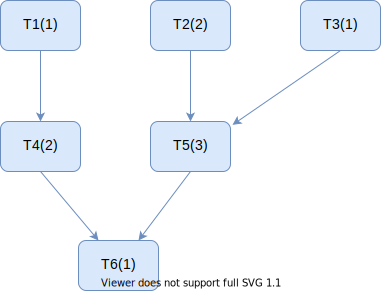

DPsim implements level scheduling.
A task T4 that depends on data modified by task T1 is scheduled to the level following the level of task T1.
In the simplest case, all tasks of a level have to be finished before tasks of the next level are started.

The dependencies of tasks on data are determined by referencing the attributes that are read or modified by the task.
The scheduler computes the schedule prior to the simulation from the task dependency graph resulting from the tasks' data dependencies.