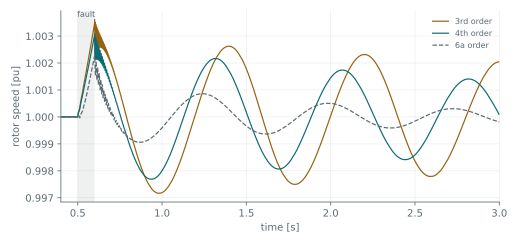

Everything so far has been passive. A synchronous machine brings two things that no previous
tutorial needed: it has mechanical state, so it can swing, and it has to be told the operating point
it starts from rather than deducing it.

The network is a machine feeding a strong grid through a line, with a fault applied at the machine
terminal for 100 ms.

## Machine parameters

A machine is specified by operational parameters rather than winding data:

```python
gen = dpsimpy.dp.ph1.SynchronGenerator4OrderVBR("gen")
gen.set_operational_parameters_per_unit(
    nom_power=555e6, nom_voltage=24e3, nom_frequency=60.0, H=3.7,
    Ld=1.81, Lq=1.76, L0=0.15,
    Ld_t=0.3, Lq_t=0.65, Td0_t=8.0, Tq0_t=1.0,
)
```

The inductances are in per unit on the machine's own base and the time constants in seconds. `H` is
the inertia constant, and it sets how fast the machine can accelerate: a low `H` swings further for
the same disturbance.

Each model order takes a different parameter set, and the difference is exactly the states it keeps.
The third order model omits `Lq_t` and `Tq0_t` because it has no q-axis rotor state at all. The
sixth order model adds the subtransient set, `Ld_s`, `Lq_s`, `Td0_s`, `Tq0_s` and `Taa`. Passing the
wrong set raises a `TypeError` listing the accepted signature. The equations are derived under
[reduced order machine models]().

## The machine base and the network around it

The machine parameters are per unit on the machine's own base, while the line is given in ohms, so
the two only make sense together. The base impedance follows from the machine rating,

```math
Z_{base} = \frac{V_{nom}^2}{S_{nom}} = \frac{(24\,\mathrm{kV})^2}{555\,\mathrm{MVA}} = 1.04 \ \Omega .
```

A line reactance of a few tenths of an ohm is therefore a few tenths per unit, which is an ordinary
transmission connection. The same line specified as 20 mH would be 7.5 Ω, above 7 per unit, and no
machine delivers rated power through that.

{}
The consequence is worth knowing because it is not reported as an error. A machine asked to deliver
more power than the network can carry simply accelerates: the rotor speed climbs monotonically and
never returns, which looks like an unstable model rather than an impossible operating point.
{}

## Initializing the machine

The network is initialized from a powerflow exactly as in
[the two-bus tutorial](). The machine additionally needs its own
operating point:

```python
system_dp.init_with_powerflow(systemPF=system_pf, domain=dpsimpy.Domain.DP)

vterm = n1.initial_single_voltage()          # from the powerflow, magnitude and angle
gen.set_initial_values(
    init_complex_electrical_power=complex(300e6, 0),
    init_mechanical_power=300e6,
    init_complex_terminal_voltage=vterm,
)
```

{}
Take the terminal voltage from the node rather than writing it out. It is tempting to pass
`complex(24e3, 0)` since that is the scheduled magnitude, but the generator bus is a PV bus and its
voltage **leads** the slack: here by 0.158 rad, about 9°. Supplying angle zero gives the machine a
rotor position inconsistent with the network it is connected to, and it starts by swinging into
agreement.
{}

The difference is measurable. With the angle assumed zero, the rotor speed oscillates by ±0.33% for
the first half second, and a fault applied at 0.5 s lands on top of a transient that has nothing to
do with it. Taking the voltage from the node, the pre-fault speed is flat to 5 × 10⁻⁶ pu and the
only thing in the result is the fault.

That the mechanical power equals the scheduled electrical power is the other half of the same
condition: if they disagree, the machine accelerates or decelerates from the first step.

## What the model order changes

The same fault, applied to the same machine at the same instant, with three model orders:



| Model order | Peak speed | States |
| --- | --- | --- |
| 3rd | 1.00362 pu | field winding only |
| 4th | 1.00308 pu | field and one q-axis damper |
| 6a | 1.00228 pu | transient and subtransient, both axes |

All three peak at the clearing instant and all three recover, but the third order model swings
noticeably further. That is not numerical: omitting the q-axis rotor removes damping that is
physically present, so the third order machine is optimistic about how far it swings and
pessimistic about how well it settles.

The practical reading is that model order is a statement about which phenomena you intend to
capture. For a first-swing stability question the fourth order model is the usual choice. The
subtransient orders matter when the first cycles after the fault are the subject rather than the
envelope of the swing.

## The script

The complete script for this page is [`06_a_machine.py`](https://github.com/sogno-platform/dpsim/blob/master/examples/Python/Tutorials/06_a_machine.py) under `examples/Python/Tutorials`. The numbers quoted above are the numbers it prints, so if the two ever disagree the page is the one that is wrong.

## Next

The machine is a source of energy with its own dynamics. Next is a converter, where the dynamics
are in the control rather than in a rotor.
