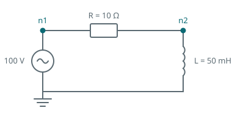

The circuit in [your first simulation]() reaches its final value in
a single step. A resistor is a purely algebraic element: it stores no energy, so the circuit has no
state variable and its response to a change is instantaneous.

An inductor stores energy in its magnetic field, and its current cannot change instantaneously. That
current becomes a state variable, the circuit becomes first order, and it acquires a transient worth
looking at and a reason to care about the time step.



## The circuit

A source, a resistor and an inductor in series. Only the inductor is new; everything else is the
same shape as before.

```python
import dpsimpy
import villas.dataprocessing.readtools as rt

name = "rl_circuit"

gnd = dpsimpy.dp.SimNode.gnd
n1 = dpsimpy.dp.SimNode("n1")
n2 = dpsimpy.dp.SimNode("n2")

src = dpsimpy.dp.ph1.VoltageSource("src")
src.V_ref = complex(100, 0)

r = dpsimpy.dp.ph1.Resistor("r")
r.R = 10.0

l = dpsimpy.dp.ph1.Inductor("l")
l.L = 0.05

src.connect([gnd, n1])
r.connect([n1, n2])
l.connect([n2, gnd])

system = dpsimpy.SystemTopology(50, [gnd, n1, n2], [src, r, l])

logger = dpsimpy.Logger(name)
logger.log_attribute("i_l", "i_intf", l)

sim = dpsimpy.Simulation(name)
sim.set_domain(dpsimpy.Domain.DP)
sim.set_system(system)
sim.set_time_step(1e-4)
sim.set_final_time(0.05)
sim.add_logger(logger)
sim.run()

current = rt.read_timeseries_dpsim("logs/" + name + ".csv")["i_l"]
```

A second node appears because the resistor and the inductor meet somewhere, and that junction is a
node like any other. Components connect to nodes, never directly to each other, so a series chain of
two elements always needs the node between them.

## What to expect before running it

Two numbers are worth working out first, because they are what the result should be checked against.

The steady-state current follows from the impedance at the system frequency,

```math
|I| = \frac{|V|}{\sqrt{R^2 + (\omega L)^2}}
    = \frac{100}{\sqrt{10^2 + (2\pi \cdot 50 \cdot 0.05)^2}}
    = \frac{100}{18.62} = 5.37 \ \mathrm{A},
```

and the transient decays with the time constant $\tau = L/R = 5$ ms, so the circuit settles after
roughly five of those, about 25 ms. The simulation runs for 50 ms, comfortably past that.

Getting 5.37 A at the end is the check that the circuit was built as intended. A wrong connection
order or a missing component usually shows up here rather than as an error.

## Why the time step matters now

Run the same circuit twice, once at 0.1 ms and once at 5 ms, and compare the inductor current:

| Time | 0.1 ms step | 5 ms step |
| --- | --- | --- |
| 5 ms | 5.699 A | 2.953 A |
| 10 ms | 6.105 A | 6.256 A |
| 20 ms | 5.271 A | 5.276 A |
| 50 ms | 5.371 A | 5.366 A |

At 5 ms the two disagree by nearly a factor of two. By 20 ms they agree to better than a tenth of a
percent, and both end at the right steady-state value.

{}
That pattern is the whole point. The coarse run is not uniformly wrong; it is wrong **during the
transient** and right afterwards. A step size equal to the time constant cannot resolve a change
that happens over one time constant, but it has no trouble with a value that is no longer changing.
Checking a simulation only at its final value will therefore not detect a step size that is far too
large.
{}

The rule that follows: choose the step against the fastest thing you need to see, not against the
duration of the run or the value you expect at the end. Here the fastest thing is $\tau = 5$ ms, and
0.1 ms resolves it with room to spare.

## What the values mean in this domain

The current is complex, and `abs()` gives the magnitude of the envelope rather than an instantaneous
current. In this domain the 50 Hz oscillation is not in the numbers at all: it has been moved into
the carrier and handled analytically, which is why a 0.1 ms step is generous here and would be
merely adequate for the same circuit solved as a waveform.

That difference is the subject of a later step. For now it is enough to know that a flat line in a
dynamic phasor result means a steady sinusoid, not a constant.

## The script

The complete script for this page is [`02_adding_dynamics.py`](https://github.com/sogno-platform/dpsim/blob/master/examples/Python/Tutorials/02_adding_dynamics.py) under `examples/Python/Tutorials`. The numbers quoted above are the numbers it prints, so if the two ever disagree the page is the one that is wrong.

## Next

The circuit still has one source and one branch. Next is a network with a line between two buses,
where the state the simulation starts from stops being obvious.

The elements used here are derived under
[RLC elements](), and the trapezoidal companion
models behind them under [nodal analysis]().
