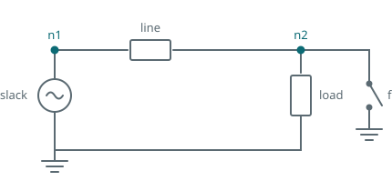

The network from [the previous tutorial]() starts in steady state,
so anything that happens to it now is a response to the event rather than to startup. This tutorial
applies a fault at the load bus, clears it, and looks at what the clearing does.



## Scheduling an event

A switch is an ordinary component. What makes it a fault is that its state is changed partway
through the run by an event.

```python
fault = dpsimpy.dp.ph1.Switch("fault")
fault.set_parameters(open_resistance=1e9, closed_resistance=10.0)
fault.open()
fault.connect([gnd, n2])

# ... build the topology including `fault` ...

sim.add_event(dpsimpy.event.SwitchEvent(0.1, fault, True))   # apply
sim.add_event(dpsimpy.event.SwitchEvent(0.2, fault, False))  # clear
```

The switch is created open and connected between the load bus and ground, so closing it puts a
10 Ω path to ground at that bus. `SwitchEvent` takes the time, the switch, and the state to move to:
`True` closes, `False` opens.

The switch must be in the topology's component list like anything else. A switch that is created,
connected and given events but left out of the list produces a run with no fault and no error.

Set a time step small enough to resolve the event. At 0.1 ms the fault instant is captured within
one step; a millisecond step would smear it.

## What happens

The load bus sits at 20 080 V, drops to 19 090 V while the fault is on, and recovers afterwards.
The drop is modest because a 10 Ω fault on a 20 kV bus is not a solid short and the source is stiff.

The interesting part is the instant of clearing:

| Time | Bus voltage |
| --- | --- |
| 0.1999 s | 19 090 V |
| 0.2000 s | 22 684 V |
| 0.2001 s | 29 036 V |
| 0.2002 s | 33 103 V |
| 0.2003 s | **34 011 V** |
| 0.2005 s | 26 726 V |
| 0.2007 s | 14 642 V |
| 0.2009 s | 9 081 V |

The bus voltage rings between 34 kV and 9 kV within a millisecond, a 70% overshoot on a network that
was in steady state a moment earlier.

## Why, and what to do about it

This is not the physical response of the circuit. Opening the switch asks the simulation to
interrupt the current flowing through the line inductance within one time step, and an inductor
current cannot change instantaneously. With the trapezoidal companion model the result is a
numerical oscillation that decays slowly, as explained under
[switches]().

A real breaker does not do this, because an arc forms across the opening contacts and dissipates the
stored energy over a short but finite interval. The variable-resistance switch reproduces that: it
raises its resistance over several steps rather than in one.

Two changes are needed, and the second is easy to forget:

```python
fault = dpsimpy.dp.ph1.varResSwitch("fault")
fault.set_parameters(open_resistance=1e9, closed_resistance=10.0)
fault.open()
fault.set_init_parameters(1e-4)   # must match the simulation time step
```

{}
`set_init_parameters` takes the time step and derives the rate at which the resistance is raised
from it. Without the call the component keeps a default rate that is correct only for a 1 ms step,
so a simulation at any other step size gets a transition of the wrong duration. Nothing warns you.
{}

With the same fault at the same instant:

| Time | Plain switch | Variable-resistance switch |
| --- | --- | --- |
| 0.1999 s | 19 090 V | 19 090 V |
| 0.2001 s | 29 036 V | 19 595 V |
| 0.2003 s | 34 011 V | 20 432 V |
| 0.2006 s | 20 511 V | **20 943 V** |
| 0.2009 s | 9 081 V | 20 580 V |

The oscillation is gone. The voltage rises smoothly to a 20 943 V peak, a 4% overshoot rather than
70%, and settles back to its pre-fault value.

Use the plain switch for switching that does not interrupt inductive current, and the
variable-resistance switch for faults, particularly at a machine terminal or a transformer winding.
The cost is that the system matrix changes on every step of the transition rather than once, so each
of those steps needs a refactorisation.

## The script

The complete script for this page is [`04_applying_a_fault.py`](https://github.com/sogno-platform/dpsim/blob/master/examples/Python/Tutorials/04_applying_a_fault.py) under `examples/Python/Tutorials`. The numbers quoted above are the numbers it prints, so if the two ever disagree the page is the one that is wrong.

## Next

The results so far have been envelopes. Next is running the same circuit as instantaneous waveforms
and comparing the two, which is where the domains stop being an abstraction.
