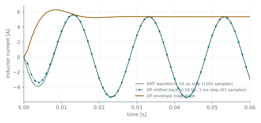

Every result so far has been an envelope, and the pages have said that an envelope is not a
waveform without showing what the difference costs. This tutorial runs the same circuit both ways
and puts the two on one axis.

The circuit is the RL branch from [adding dynamics](), unchanged.

## Building the same circuit twice

Only the namespaces differ. `dpsimpy.emt.ph1` instead of `dpsimpy.dp.ph1`, and `Domain.EMT` instead
of `Domain.DP`:

```python
def build(domain, ns, ph1, name, dt):
    gnd = ns.SimNode.gnd
    n1 = ns.SimNode("n1")
    n2 = ns.SimNode("n2")

    src = ph1.VoltageSource("src")
    src.set_parameters(
        V_ref=complex(100, 0),
        f_src=(50.0 if domain == dpsimpy.Domain.EMT else 0.0),
    )

    r = ph1.Resistor("r"); r.set_parameters(R=10.0)
    l = ph1.Inductor("l"); l.set_parameters(L=0.05)

    src.connect([gnd, n1]); r.connect([n1, n2]); l.connect([n2, gnd])

    system = dpsimpy.SystemTopology(50, [gnd, n1, n2], [src, r, l])
    logger = dpsimpy.Logger(name)
    logger.log_attribute("i_l", "i_intf", l)

    sim = dpsimpy.Simulation(name)
    sim.set_domain(domain); sim.set_system(system)
    sim.set_time_step(dt); sim.set_final_time(0.06)
    sim.add_logger(logger)
    sim.run()
    return rt.read_timeseries_dpsim("logs/%s.csv" % name)

emt = build(dpsimpy.Domain.EMT, dpsimpy.emt, dpsimpy.emt.ph1, "cmp_emt", 5e-5)["i_l"]
dp = build(dpsimpy.Domain.DP, dpsimpy.dp, dpsimpy.dp.ph1, "cmp_dp", 1e-3)
dp_shift = ts.frequency_shift_list(dp, 50)["i_l_shift"]
```

## The one parameter that means different things

`f_src` is **not** the same quantity in the two domains, and this is the single easiest way to get a
wrong answer here.

{}
In EMT it is the absolute frequency of the source, so 50 Hz means 50 Hz. In DP and SP it is an
**offset from the carrier**, so passing 50 there gives a source at 100 Hz. Leave it at zero, or
omit it, when you want a source at the system frequency in an envelope domain.

Getting this wrong is not obvious from the output: the simulation runs, and the current is simply
smaller than it should be because the inductive reactance has doubled. In this circuit the wrong
setting gives 3.02 A instead of 5.37 A, which looks like a plausible number rather than an error.
{}

## The comparison



The dashed line is the dynamic phasor result shifted back onto the 50 Hz carrier. It lies on the EMT
waveform. The third curve is the envelope magnitude itself, which is what the DP simulation actually
computed: the smooth rise to 5.37 A that the oscillation is riding on.

| Quantity | EMT | DP shifted back |
| --- | --- | --- |
| Time step | 50 µs | 1 ms |
| Samples over 60 ms | 1201 | 61 |
| Peak current, steady state | 5.3703 A | 5.3603 A |
| Current at t = 60 ms | −2.8839 A | −2.8840 A |

Twenty times fewer steps, and the same answer to four significant figures.

## Why this works, and when it does not

The saving is not because the envelope model is coarser. For a single carrier the transform is
exact. The 50 Hz oscillation has been moved out of the integrated quantity and into a coefficient
handled analytically, so the step size is set by how fast the envelope changes rather than by the
carrier. Here the envelope settles with a 5 ms time constant, and 1 ms resolves it comfortably.

What an envelope domain cannot represent is content outside the band it retains around the carrier.
A harmonic, a fast switching transient, or a wideband disturbance is simply absent. That is the
trade, and it is the reason both domains exist rather than one being better.

The transform itself is derived under
[dynamic phasors]().

## Reading it back

`frequency_shift_list` appends `_shift` to every key, so the shifted series is `i_l_shift` and not
`i_l`. Asking for the original name after shifting raises a `KeyError` that reads like a missing
signal.

## The script

The complete script for this page is [`05_comparing_domains.py`](https://github.com/sogno-platform/dpsim/blob/master/examples/Python/Tutorials/05_comparing_domains.py) under `examples/Python/Tutorials`. The numbers quoted above are the numbers it prints, so if the two ever disagree the page is the one that is wrong.

## Next

The circuits so far have been passive. Next is a synchronous machine, where the model order becomes
a choice and initialization from a powerflow stops being optional.
