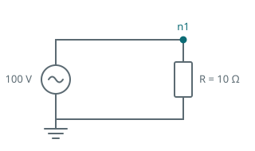

This page goes from nothing to a plotted result. It assumes DPsim is installed and importable; if
it is not, start with [install]() or [build]().

The circuit is deliberately trivial, a voltage source feeding a resistor, so that nothing in it
distracts from the shape of the script. Every real simulation has the same five parts in the same
order.



## The whole script

```python
import dpsimpy
import villas.dataprocessing.readtools as rt
from villas.dataprocessing.timeseries import TimeSeries as ts

name = "first_simulation"

# 1. Nodes
gnd = dpsimpy.dp.SimNode.gnd
n1 = dpsimpy.dp.SimNode("n1")

# 2. Components
src = dpsimpy.dp.ph1.VoltageSource("src")
src.V_ref = complex(100, 0)

load = dpsimpy.dp.ph1.Resistor("load")
load.R = 10.0

# 3. Connections
src.connect([gnd, n1])
load.connect([n1, gnd])

# 4. Topology
system = dpsimpy.SystemTopology(50, [gnd, n1], [src, load])

# 5. Logging, then run
logger = dpsimpy.Logger(name)
logger.log_attribute("n1.v", "v", n1)
logger.log_attribute("load.i_intf", "i_intf", load)

sim = dpsimpy.Simulation(name)
sim.set_domain(dpsimpy.Domain.DP)
sim.set_system(system)
sim.set_time_step(1e-3)
sim.set_final_time(0.1)
sim.add_logger(logger)
sim.run()
```

Running it prints solver progress and writes `logs/first_simulation.csv`.

## What each part is doing

**Nodes come first** because components connect to them, not to each other. `SimNode.gnd` is the
reference node and is shared; every network needs it. Nodes are chosen from a domain namespace,
`dpsimpy.dp` here, and a node from one domain cannot be connected to a component from another.

**Components are created, then configured through their attributes.** `src.V_ref = complex(100, 0)`
sets the source reference as a complex phasor, because this is the dynamic phasor domain and a
voltage is an envelope rather than an instantaneous value. In EMT the same field would carry a
different meaning; see [dynamic phasors]().

{}
**Connection order defines polarity.** `src.connect([gnd, n1])` means terminal 0 at ground and
terminal 1 at `n1`, so a positive current flows from terminal 0 to terminal 1 inside the component.
Reversing the list reverses the sign of everything that component reports. Nothing checks this for
you, and a sign error here produces a simulation that runs and is wrong.
{}

{}
**The topology takes the system frequency first**, then the nodes, then the components. Anything not
in those two lists is not simulated, even if it was created and connected. This is the most common
reason a component appears to have no effect.
{}

**Logging is opt-in, and takes three steps in order.** Nothing is recorded unless a logger asks for
it.

```python
logger = dpsimpy.Logger(name)                          # 1. create it; the name becomes the file name
logger.log_attribute("n1.v", "v", n1)                  # 2. register each attribute you want
logger.log_attribute("load.i_intf", "i_intf", load)
sim.add_logger(logger)                                 # 3. attach it to the simulation, before run()
```

`log_attribute` takes the column name you want, the name of the attribute on the object, and the
object itself. `"v"` on a node is its voltage; `"i_intf"` on a component is the current through it.
The first argument is yours to choose and is the key you will use when reading the file back; the
second must be an attribute the object actually publishes, and `print_attribute_list()` on the
object shows what that is.

{}
A value a component computes internally but does not publish as an attribute cannot be recorded by
any logger option. `print_attribute_list()` on an object shows what it publishes.
{}

The order is what makes it work. A logger registers attributes before it is attached, and it must be
attached before `run()`, because the column header is written from whatever is registered when the
first row is written. A logger created but never passed to `add_logger` produces no file at all,
which is the usual reason for a run that appears to have logged nothing.

## Reading the results

```python
results = rt.read_timeseries_dpsim("logs/" + name + ".csv")

print(sorted(results.keys()))
# ['load.i_intf', 'n1.v']

v = results["n1.v"]
print(v.time[1], abs(v.values[1]))
# 0.001 100.0
```

The keys are the column names given to `log_attribute`. Each value is a time series with `time` and
`values` arrays; in a dynamic phasor simulation the values are complex, and `abs()` gives the
envelope magnitude.

Note that the first sample is zero. The log is written before the first solve, so row zero is the
state the simulation started from rather than a result. From `t = 0.001` onwards this circuit sits
at exactly 100 V and 10 A, which is what a 100 V source across 10 Ω should give.

## Plotting

```python
import villas.dataprocessing.plottools as pt

pt.plot_timeseries(1, results["n1.v"].abs())
pt.plot_timeseries(2, results["load.i_intf"].abs())
```

The first argument is a figure number, so repeated calls with the same number overlay curves on one
axis. `.abs()` is needed for complex results; plotting a complex series directly is not meaningful.

## Recovering the waveform from a dynamic phasor result

A dynamic phasor result is an envelope, not a waveform. To compare it against an instantaneous
result, shift it back onto the carrier:

```python
emt = ts.frequency_shift_list(results, 50)
print(sorted(emt.keys()))
# ['load.i_intf_shift', 'n1.v_shift']
```

{}
Every key gains a `_shift` suffix, which is easy to miss and produces a `KeyError` that reads as
though the quantity were never logged. The result is a real waveform at the given carrier frequency,
and can be plotted or compared against an EMT run directly.
{}

## The script

The complete script for this page is [`01_first_simulation.py`](https://github.com/sogno-platform/dpsim/blob/master/examples/Python/Tutorials/01_first_simulation.py) under `examples/Python/Tutorials`. The numbers quoted above are the numbers it prints, so if the two ever disagree the page is the one that is wrong.

## Next

This circuit has no dynamics at all: it is a source and a resistor, so it reaches its final value in
one step and stays there. The next step is to add an element that stores energy, which is where the
choice of time step starts to matter and where a result becomes worth plotting.

The [examples]() work through larger networks, and the models used here are
derived under [sources]() and
[RLC elements]().
