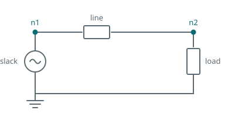

The circuits so far started from nothing and settled. That is fine for a resistor and an inductor,
and useless for a network: a real system is already running when you start looking at it, and the
transient you care about is the one caused by an event, not by switching the whole grid on.

This tutorial builds a two-bus network, solves its steady state with a powerflow, and starts the
dynamic simulation from that solution.



## Part one: the powerflow

A powerflow is a different kind of simulation. It has no time step in any meaningful sense; it
solves the algebraic steady state, iterating until the bus voltages are consistent with the
specified powers.

```python
import dpsimpy
import villas.dataprocessing.readtools as rt

Vnom = 20e3

n1pf = dpsimpy.sp.SimNode("n1", dpsimpy.PhaseType.Single)
n2pf = dpsimpy.sp.SimNode("n2", dpsimpy.PhaseType.Single)

slack = dpsimpy.sp.ph1.NetworkInjection("slack")
slack.set_parameters(voltage_set_point=Vnom)
slack.set_base_voltage(Vnom)
slack.modify_power_flow_bus_type(dpsimpy.PowerflowBusType.VD)

line = dpsimpy.sp.ph1.PiLine("line")
line.set_parameters(R=0.5, L=0.5 / 314, C=50e-6)
line.set_base_voltage(Vnom)

load = dpsimpy.sp.ph1.Load("load")
load.set_parameters(active_power=100e3, reactive_power=50e3, nominal_voltage=Vnom)
load.modify_power_flow_bus_type(dpsimpy.PowerflowBusType.PQ)

slack.connect([n1pf])
line.connect([n1pf, n2pf])
load.connect([n2pf])

system_pf = dpsimpy.SystemTopology(50, [n1pf, n2pf], [slack, line, load])

logger_pf = dpsimpy.Logger("pf")
logger_pf.log_attribute("v1", "v", n1pf)
logger_pf.log_attribute("v2", "v", n2pf)

sim_pf = dpsimpy.Simulation("pf")
sim_pf.set_system(system_pf)
sim_pf.set_domain(dpsimpy.Domain.SP)
sim_pf.set_solver(dpsimpy.Solver.NRP)
sim_pf.set_solver_component_behaviour(dpsimpy.SolverBehaviour.Initialization)
sim_pf.do_init_from_nodes_and_terminals(False)
sim_pf.set_time_step(0.1)
sim_pf.set_final_time(0.1)
sim_pf.add_logger(logger_pf)
sim_pf.run()
```

Four things here are new and none of them are optional.

The powerflow is built in the **static phasor** domain, `dpsimpy.sp`, whatever domain the dynamic
run will use. The solver is set to `Solver.NRP`, the Newton-Raphson powerflow solver, rather than
the default nodal solver.

`modify_power_flow_bus_type` is what makes the problem solvable. Every bus must declare which two of
its four quantities are known: `VD` fixes voltage magnitude and angle, and there must be exactly one
such bus, the slack, which absorbs whatever mismatch remains. `PQ` fixes active and reactive power,
which is what a load specifies. Without these the powerflow has no boundary conditions.

`set_base_voltage` is required on components because the solver works in per unit, and
`do_init_from_nodes_and_terminals(False)` tells the components not to try to initialize themselves
from node voltages that do not exist yet, since establishing those voltages is the job this
simulation is doing.

Running it gives 20 000 V at the slack and **20 075 V** at the load bus. The load bus sitting above
nominal is not an error: the line's shunt capacitance supplies more reactive power at this load than
the series impedance drops.

## Part two: the dynamic run

The dynamic network is built separately, in the domain the simulation will actually use, and then
takes its initial state from the powerflow solution.

```python
n1 = dpsimpy.dp.SimNode("n1", dpsimpy.PhaseType.Single)
n2 = dpsimpy.dp.SimNode("n2", dpsimpy.PhaseType.Single)

slack_d = dpsimpy.dp.ph1.NetworkInjection("slack")
slack_d.set_parameters(V_ref=complex(Vnom, 0))

line_d = dpsimpy.dp.ph1.PiLine("line")
line_d.set_parameters(
    series_resistance=0.5,
    series_inductance=0.5 / 314,
    parallel_capacitance=50e-6,
)

load_d = dpsimpy.dp.ph1.RXLoad("load")
load_d.set_parameters(active_power=100e3, reactive_power=50e3, volt=Vnom)

slack_d.connect([n1])
line_d.connect([n1, n2])
load_d.connect([n2])

system_dp = dpsimpy.SystemTopology(50, [n1, n2], [slack_d, line_d, load_d])
system_dp.init_with_powerflow(systemPF=system_pf, domain=dpsimpy.Domain.DP)

logger = dpsimpy.Logger("dyn")
logger.log_attribute("v2", "v", n2)

sim = dpsimpy.Simulation("dyn")
sim.set_system(system_dp)
sim.set_domain(dpsimpy.Domain.DP)
sim.set_time_step(1e-3)
sim.set_final_time(0.05)
sim.add_logger(logger)
sim.run()
```

`init_with_powerflow` matches the two networks by node name and copies the solved voltages across,
which is why the node names must agree between the two topologies. It is the only line connecting
the two halves.

The result is the point of the whole exercise. The dynamic run starts at **20 074.8 V** and ends at
**20 074.9 V**: it begins in steady state rather than settling into one. Without the powerflow it
would start from zero and spend the first several cycles charging the line, and any event applied
during that period would be mixed in with a startup transient that has nothing to do with the
system.

## Parameter names differ between domains

The same component takes different keyword names in different domains. The static phasor line takes
`R`, `L` and `C`; the dynamic phasor line takes `series_resistance`, `series_inductance` and
`parallel_capacitance`. The load is `Load` with `nominal_voltage` in the powerflow and `RXLoad` with
`volt` in the dynamic run.

{}
This catches people, and the failure is loud rather than silent: passing the wrong keyword raises a
`TypeError` that lists the accepted signature. Read that list rather than guessing, and check the
[generated reference]() when adding a component you have not used
before.
{}

## The script

The complete script for this page is [`03_two_bus_network.py`](https://github.com/sogno-platform/dpsim/blob/master/examples/Python/Tutorials/03_two_bus_network.py) under `examples/Python/Tutorials`. The numbers quoted above are the numbers it prints, so if the two ever disagree the page is the one that is wrong.

## Next

The network now starts where it should, so an event applied to it produces a clean response. Next is
applying one: a fault, using a switch.

The powerflow method is described under [powerflow](), and
the loads and lines used here under [loads]() and
[branches]().
